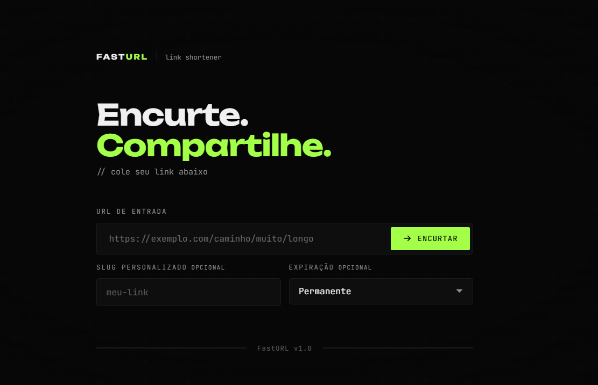

<div align="center">

  

  <h1>FastURL</h1>

  <p>Encurtador de links minimalista com slugs personalizados e links expiráveis.</p>

  
  
  

</div>

---

## Features

- **Encurtamento instantâneo** — cole a URL e obtenha o link curto em segundos
- **Slug personalizado** — escolha o código do link ao invés de um aleatório
- **Links expiráveis** — defina um TTL de 1h, 24h, 7 ou 30 dias
- **Validação completa** — verificação de URL no frontend e no backend
- **Frontend integrado** — servido pelo próprio FastAPI, sem servidor separado

---

## Stack

| Camada | Tecnologia |
|--------|------------|
| Backend | Python + FastAPI |
| Frontend | HTML + CSS + JavaScript (vanilla) |
| Servidor | Uvicorn |

---

## Estrutura

```
fasturl/
├── main.py           # Backend FastAPI
├── index.html        # Frontend
├── robots.txt
├── sitemap.xml
├── docs/
│   └── preview.png
└── static/
    └── scripts.js    # Lógica do frontend
```

---

<div align="center">
  <sub>Feito com FastAPI</sub>
</div>
